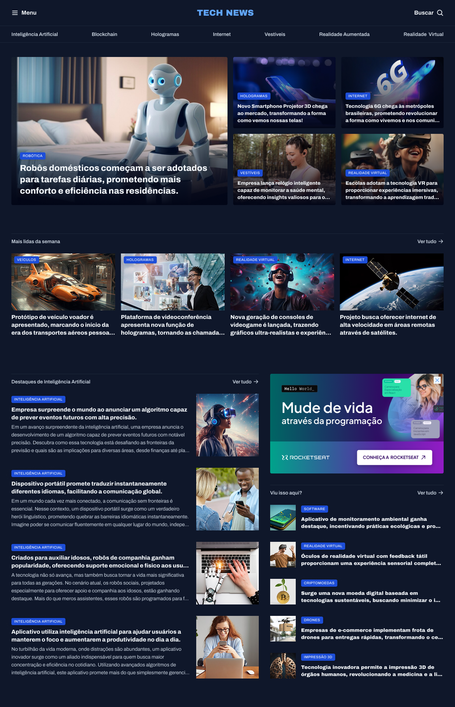

# 📰 Portal de Notícias

Um projeto de site responsivo com foco em **tecnologia, inovação e experiência do usuário**, desenvolvido com HTML5 e CSS3.  
O layout simula um portal moderno de notícias tecnológicas, com seções destacadas, imagens e navegação estruturada sem JavaScript.


---

## 🔗 Acesse o projeto

> Você pode visualizar o projeto diretamente [clicando aqui](https://portal-de-noticias-zeta-five.vercel.app/).

---

## 🛠️ Tecnologias Utilizadas

- **HTML5**: estruturação semântica de conteúdo
- **CSS3**: estilização com variáveis, grid layout e responsividade
- **Fontes**: Google Fonts - Archivo
- **Favicon & ícones** personalizados
- **Imagens otimizadas** para performance

---

## 📁 Estrutura de Pastas

```
📦 portal_de_-_noticias
│
├── assets
│   ├── Ads.png
│   ├── favicon.svg
│   ├── logo.svg
│   ├── project_cover.png
│   ├── project_image.png
│   ├── images/
│   │   └── Image 01.png → Image 12.png
│   └── icons/
│       ├── ArrowRight.svg
│       ├── ArrowRight-hover.svg
│       ├── List.svg
│       └── MagnifyingGlass.svg
├── styles
│   ├── global.css
│   ├── header.css
│   ├── index.css
│   ├── sections.css
│   └── utility.css
├── .gitignore
├── index.html
└── readme.md
```

---

## ✨ Funcionalidades

- Menu de navegação com seções tecnológicas
- Destaques visuais com imagens e categorias
- Seção de mais lidas da semana
- Destaques em Inteligência Artificial
- Área lateral com recomendações e publicidade
- Layout responsivo com CSS Grid
- Separação modular de estilos (@import no index.css)

---

## 🎯 Objetivo do Projeto

Este projeto tem como objetivo praticar a estruturação semântica, organização de estilos em múltiplos arquivos e o uso de CSS Grid para criação de layouts modernos e flexíveis — simulando a estrutura de um portal real de conteúdo.

---

## 📸 Prévia



---

## 📚 Aprendizados

- Organização de CSS com abordagem modular (global, utilitários, cabeçalho e seções)
- Uso de variáveis CSS para temas e consistência visual
- Controle de responsividade com grid-template-areas
- Prática de boas práticas HTML e acessibilidade básica

---

## 🚀 Próximos Passos

- Adicionar versão com JavaScript para busca interativa
- Implementar temas claro/escuro
- Tornar o portal dinâmico com dados via JSON ou API fake

---

## 👨‍💻 Autor

Desenvolvido por **Rocketseat**
Adaptado e implementado por **William Milanez**.

---

## 📄 Licença

Este projeto é de uso educacional e livre para fins de estudo e prática pessoal.
